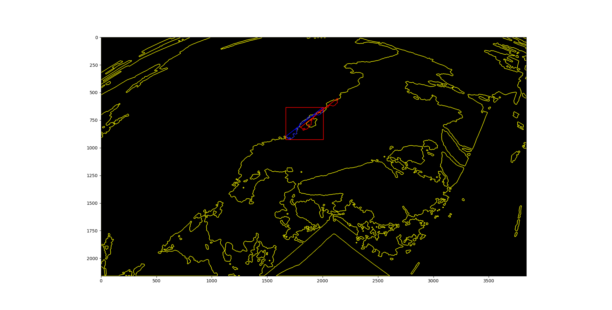
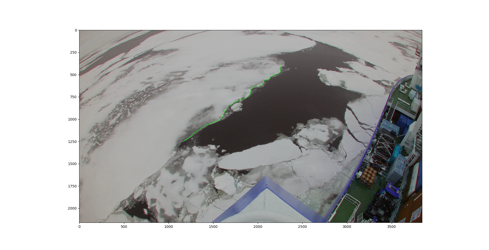

# Ice_sheet_tracking

_Package to detect and track floating ice sheets in the ocean from video frames_

Currently, there are 4 versions in progress:  
1. statistical tracker:  
   automatically detects ice floe contours, saves them as objects and inits a tracker on it
   in every next step it assigns and thus updates known objects or creates new
   added a drift calculation for each single and whole result using for evaluation and result refinement
   works good so far. Some refinement could be made  
   Thresholds calibrated with a video and not the correct footage  
3. Roid tracker:  
   offers 3 modes:  
   a. Manual Roid:
      user selects a roid, software detects elements and user selects the correct one
      user selects roid on a future roid, same procedure and the program calculates
      drift direction and speed  
   b. manual Line:  
      user selects a roid, user draws contour line, software detects corresp. real contour piece
      user selects roid on a future roid, same procedure and the program calculates
      drift direction and speed  
      might be useful to add some features from Line Tracker ... area reduction / hu moments (if working)  
   c. semiautomaticLine:  
      same as above but on the second frame the program tries to identify the corresponding
      contour on automatically (not very robust so far due to matching sensible to transl./rot./scale)
      if not: manual again  
      might be useful to add some features from Line Tracker ... area reduction / hu moments (if working)  
5. Line tracker:  
   kind of manuel statistical tracker
   useful if no little seperated ice floes are visible
   can thus track huge floes drifting through the FOV
   the user draws a line on first frame which should cover a contour segment of
   some ice floe
   the software detects and assigns the correct in-image contour to the drawn line
   on future frames detects a similar contour segment and so tracks this drawn line
   automatically reduces search area  
    
   Here I have 2 attempts:  
   a. uses template matching package --> is really instable since the matching is sensitive to trans.,rot.,scale  
   b. This approach uses a Hu moments comparison in sliding windows
      curiously the matching is really bad....!
 

## ToDo

- make line tracker more robust
      - check and correct hu moment matching
- add line tracker features to roidtracker
- bilder mit sättigung verfeinern?!
- aktuelle version fertig mit anzeigen in einzelnen frames etc
    - nochmal mit contour_binary input testen

## state of tracking results
### Statistical Tracker results

### Line Tracker matching

### user line input

